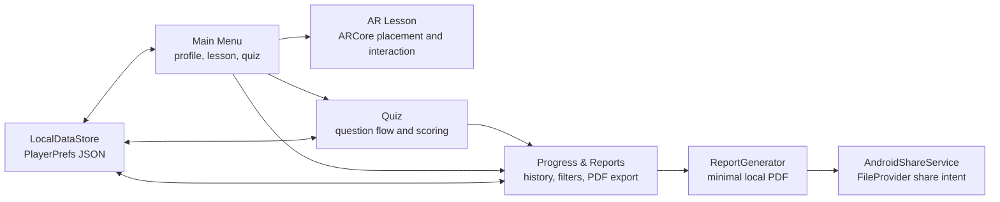

# Architecture

Technical overview of **AR Education**, a local-first Android AR classroom app.

## High-Level Flow

The app has no backend, account system, analytics, telemetry, or cloud sync. Each student-owned device stores its own profile, quiz attempts, reports, and diagnostics locally.

## Scenes

| Build Index | Scene | Responsibility |
|---|---|---|
| 0 | `MainMenu` | Navigation, lesson/quiz selection, student profile settings |
| 1 | `ARLesson` | ARCore session, camera permission, placement, lesson controls |
| 2 | `Quiz` | Quiz loading, scoring, result save, report/export actions |
| 3 | `TeacherDashboard` | Student-facing Progress & Reports screen |

`DataManager` and `SceneLoader` are persistent singletons created from the main menu scene.

## Data Layer

Core models live in `Assets/Scripts/Data/DataModels.cs`.

| Type | Purpose |
|---|---|
| `StudentProfile` | Stable local `studentId`, name, grade level, class name, creation time |
| `QuizResult` | Attempt ID, student, lesson, score, timestamp, duration, app version |
| `ReportExport` | Export ID, student ID, created time, file path, included lesson IDs |

`LocalDataStore` wraps PlayerPrefs and validates/catches corrupt JSON before returning data. It migrates legacy `quiz_results_v1` into `quiz_results_v2` only when present. Mock/sample results are not merged into production progress by default; the explicit sample load path is editor/development-only.

`ReportGenerator` writes a dependency-free PDF file under `Application.persistentDataPath/Reports`. `AndroidShareService` shares it on Android using a manifest `FileProvider`; outside Android it logs the exported path.

`DiagnosticsLogger` keeps a rolling local log in PlayerPrefs for troubleshooting. It does not transmit data.

## AR Runtime

`ARSessionController` handles camera permission, ARCore availability, initialization, unsupported states, and retry/help UI. Camera denial is surfaced instead of waiting indefinitely.

`ARPlacementManager` raycasts against detected planes, places the selected lesson object, hides plane visuals after placement, and supports reset/reposition so students can move the lesson to a better surface.

`ARObjectManipulator` supports one-finger drag and two-finger scale/rotation. Lesson controllers guard missing camera/session references so runtime asset issues degrade gracefully.

## Lessons And Quizzes

Lessons remain local and procedural:

- Triangle mesh generation uses the cosine rule and Heron's formula.
- Physics lesson visualizes `d = v * t`.
- Cube lesson generates per-face geometry for stable hit/normal behavior.

Quiz JSON files load from `Resources/QuizData`. Quiz completion immediately saves a local `QuizResult` and exposes both **View Progress** and **Export PDF Report** actions.

## Android Production Configuration

| Setting | Value |
|---|---|
| Product | `AR Education` |
| Package | `com.areducation.app` |
| Required permissions | Camera |
| ARCore | Required |
| Backup | Disabled |
| Hardware acceleration | Enabled |
| Min SDK | 24 |
| Target SDK | 34 |
| Backend / ABI | IL2CPP / ARM64 |

The Android release workflow uses Unity `6000.4.8f1`, builds a signed APK artifact, and does not depend on WebGL or GitHub Pages.

## Verification

EditMode tests cover quiz JSON validity, `LocalDataStore` resilience, mesh generation, and PDF output. Android manual QA should cover camera permission allow/deny, unsupported ARCore state, placement reset, gestures, quiz persistence, PDF sharing, app reopen persistence, and clear-data behavior.
